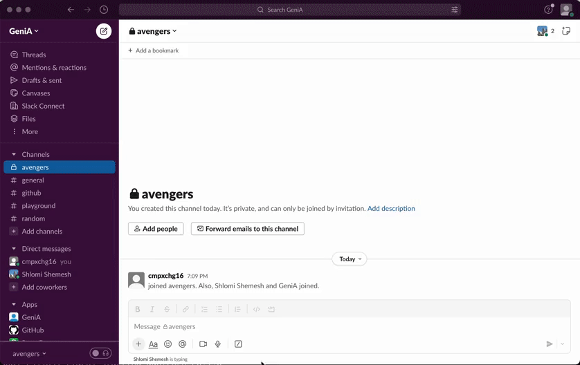

[](https://opensource.org/licenses/Apache-2.0)


# Meet GeniA 🧬🤖💻

Your own engineering GenAI virtual superhero!

Imagine ChatGPT, empowered by your tools and apis, acting on your behalf, automating those time wasters and repetative tasks. all in natural language and right in your team's slack channel!

#### We introduce you to the future of software engineering with Tools 3.0!

**[note]** This is not just a visionary multi-agent project; we have set ourselves the goal of building a production-grade software right off the bat. Now, you can start working with GeniA in production by installing the GeniA container, integrating it into your team's Slack channel, and getting started.

### GeniA is fun!

There has been a lot of buzz around ChatGPT and CoPilot boosting writing new code, but as software engineers we know that writing code is just a part of our day to day.

Imagine a team member helping you:

* increase the memory for my node service deployed on k8s cluster
* rollout your k8s based service to production using argo
* summarize production logs
* write code for a new utility and deploy to a lambda function
* look at your metrics for service usage anomalies
* look for security vulnerabilities over my s3 buckets
* trigger a new build
* generate reports for unutilized cloud resources
* add a cron to trigger a function
* scale out your services

<p align="center">
<br/>
<br/>
<br/>
   
<br/>
<br/>
<br/>
</p>


### GeniA is 100% open source!

Built with love by engineers for engineers, so you can now onboard your new engineering superhero to your team.

### GeniA is rapidly learning new tools!

GeniA can be taught new tools blazingly fast, one of our main goals was to simplify it as much as possible (WIP)

1. code tools - GeniA can call any class+method you have by adding simple spec
   this is an example of using a langchain tool, right out of the box, but can be any class
   ```
   - tool_name: search_serp_api
     category: python
     class: langchain.utilities.serpapi.SerpAPIWrapper
     method: run
   ```
2. add any url - GET with either path or request parameters by simply adding:

   ```
   - tool_name: get_current_weather
     title: get the current weather details
     category: url
     template: https://api.open-meteo.com/v1/forecast?latitude={latitude}&longitude={longitude}&temperature_unit=celsius&current_weather=true
   ```
3. standard openapi swagger files

   GeniA can invoke any standard openapi out there, easily integrated by a swagger file. this is a work in progress, there is a working example plugged in out of the box
4. natural language skills

   experimental capability of GeniA to keep steps he took to acomplish a task in memory, label and save them under a new skill he learned so it can be then loaded into memory and followed upon. all using natural language

### Available tools

* [ArgoCD](https://argoproj.github.io/cd/)
* [AWS](https://aws.amazon.com/)
* [GitHub](http://github.com/)
* [Jenkins](https://www.jenkins.io/)
* [Kubernetes](https://kubernetes.io/)
* [Open Policy Agent (OPA)](https://www.openpolicyagent.org/)
* [PagerDuty](https://www.pagerduty.com/)
* [Slack Webhook](https://api.slack.com/messaging/webhooks)

The list of supported tools can be found [here](./genia/tools_config/tools.yaml).    
The list of OpenAI functions spec which used by the tools can be found [here](./genia/tools_config/functions.json).

### How is GeniA different from just using an LLM?

1. Using tools that are taking actions in a live enviroment can be risky, you don't want to let the model run around and make his own decisions.... well, not just yet.
2. we reimagine the way engineers are using LLMs. currently with ChatGPT you are asking the model for advice, and using chat, it guides you with recommendations and the steps **you** need to take. GeniA on the other hand is more than happy to go ahead and actually do the work itself, for example you can write a code snippet and have genia deploy it to lambda. GeniA is connected to your production enviroment, CI/CD tools and everything else you need.
3. the list of tools GeniA is familiar with will soon be THOUSANDS, but with the limited nature of the LLM context window and the cost per token, it makes most sense to only send the most relevant tools for the model to use. so we invented a tool that can find tools! we leverage the power of vector dbs (FAISS by default) to look for the tools with the description that matches your intent best and send only those to the model

### GeniA is rapidly learning new tools!

we use the power of the community to further enrich the tools, skills and best practices GeniA is familiar with.

you can mix and match any of them and create your own company specific tools, contribute back to the community to help others!


## So what's next on the roadmap?

- support open ai based on azure
- support SSO with OKTA integration so your slack user identity can be used to invoke the tools with your user authentication and audit
- RBAC support, so the tool usage permissions are enforced in a standard way using your company's standards

# Table of Contents

- [Introduction](#introduction)
- [Getting Started](#getting-started)
- [Installation](#installation)
- [Contributing](#contributing)
- [License](#license)
- [Contact](#contact)

# Introduction

GeniA is an generative AI agent which is base on [OpenAI function calling capability](https://openai.com/blog/function-calling-and-other-api-updates) and is familiar with your tools and company policies

### How does it work?

### GeniA can learn new skills

you can add new tools to GeniA and teach him additional new skills

adding a new tool is based on [OpenAI json configuration](https://platform.openai.com/docs/api-reference/chat/create#chat/create-functions) file so we keep it standard to easily import any existing function calling project or any ChatGPT plugin

the only thing missing is a short description for the model the describe when the function should be used and we prefered keeping it in a separated file - link to tools.yaml

### GeniA Security

GeniA is stateless, it keeps its current conversations in memory but you can integrate it to one of your cloud dbs, so no worries of GDPR, SOC-2 and similar. We use OpenAI API, and it can be easily connected to your own Azure OpenAI enviroment
GeniA is 100% open source so you can install it in your own cloud enviroment.

A word regarding secrets, for now the project using environment varibales by [.evn.template](.evn.template), but we are working on standard secrets store providers integrations.

**We currently recommend integrating GeniA to a specific private channel with permissions to a white list of engineers.**

We are currently working on SSO and RBAC support for GeniA, which will be available in the near future.

### So can GeniA connect to any API out there?

Of course it can, this is an active academic research but not a real production grade tool.

We took the open ai approach for plugins but simplified it and allow you to integrate it to any of your existing classes of code or available apis

What we landed on is the ability to learn new skills with no need for model fine tunining or in many cases even the need to redeploy your service.

In many cases though, adding a brand new tool requires some prompt tuning and testing.

The authentication of a new tool now handled by the writer of a new tool, but soon it will be generalized as part of the project.

## Getting Started

You can run GeniA in local mode via the terminal, or as Streamlit app or in organization as Slack App Bot. The easiest option is to run it locally using [Docker](#run-via-docker). In case you want to install it locally, jump to [Installation](#installation).

> **Note:**
> When using OpenAI, you should be aware of cost spending, so make sure you limit the usage. Both soft and hard limits can be set here: https://platform.openai.com/account/billing/limits.

### Run via Docker

Handle secrets by copy the [.env.template](./.env.template) into `.env`, and put in `.env` the minimal secrets which is just `OPENAI_API_KEY`


### Run in local terminal mode
```
docker run -p 5001:5001 --env-file ./.env -it genia:latest
```

### Run in slack app bot mode
```
docker run -p 5001:5001 --env-file ./.env -it genia:latest slack
```

# Developer Guide

## Run GeniA from source :: Docker

```
git clone https://github.com/GeniA-dev/GeniA
cd GeniA
docker build -t genia:latest .
```

Run via [Docker](#run-via-docker)

## Run GeniA from source :: Python

### Poetry install

```
curl -sSL https://install.python-poetry.org | python3 -
```

### Run in local terminal mode

```
poetry run python main.py local
```

### Run in slack app bot mode

[First install the bot](#create-slack-app-bot)
```
poetry run python main.py slack
```

### Run in streamlit mode

```
pip install streamlit
poetry shell
streamlit run main.py streamlit
```

## Testing

```
poetry run pytest tests
```

# Installation

### Run in Slack App Bot

#### Create Slack App Bot

> **Note:**
>
> There are two main options to [Choosing a protocol to connect to Slack](https://api.slack.com/apis/connections); We are using here the `Socket Mode` which allows your app to use the `Events API` and interactive components of the platform—without exposing a public HTTP Request URL. Instead of sending payloads to a public endpoint, Slack will use a WebSocket URL to communicate with your app.

In order to operate the Slack GPT Bot, it is necessary to define the correct permissions for your Slack bot. Please adhere to the following guidelines to arrange the required permissions:

1. In the project's root directory, mv the [.env.template](./.env.template) into `.env` file and input your Slack keys
2. Create a new [Slack App](https://api.slack.com/authentication/basics).
3. Navigate to your [Slack API Dashboard](https://api.slack.com/apps) and select the app you've created for this bot.
4. On the left-hand side menu, click on `OAuth & Permissions`.
5. Within the `Scopes` division, there are two categories of scopes: `Bot Token Scopes` and `User Token Scopes`. Append the following scopes under `Bot Token Scopes`:
   `app_mentions:read`    
   `chat:write`    
   `channels:history`    
   `groups:history`    
   `im:history`    
   `mpim:history`    
6. Ascend to the `OAuth Tokens for Your Workspace` and hit the `Install App To Workspace` button. This operation will produce the `SLACK_BOT_TOKEN`.
7. On the left-hand side menu, click on `Socket Mode` and activate it. You'll be asked to `Generate an app-level token to enable Socket Mode`. Generate a token labeled `SLACK_APP_TOKEN` and include the `connections:write` scope.
8. In the `Socket Mode` page's `Features affected` section, hit `Event Subscriptions` and switch `Enable Events` to the `On` state. Append the app_mention event, coupled with the `app_mentions:read` scope in the `Subscribe to bot events` subsection below the toggle.

# Contributing

👩‍💻➕👨‍💻 Fork GeniA repository, make your changes, and submit a pull request! We appreciate your contributions! 🙌🌟💖

# License

Licensed under the Apache License, Version 2.0 (the "License"); you may not use this file except in compliance with the License. You may obtain a copy of the License at

http://www.apache.org/licenses/LICENSE-2.0

Unless required by applicable law or agreed to in writing, software distributed under the License is distributed on an "AS IS" BASIS, WITHOUT WARRANTIES OR CONDITIONS OF ANY KIND, either express or implied. See the License for the specific language governing permissions and limitations under the License.

# Contact

Got an idea to improve our project? We'd love to hear it and collaborate with you. Don't hesitate to reach out to us! Just open an [issue](https://github.com/GeniA-dev/GeniA/issues), and GeniA will respond to you 🦸‍♀️🦸‍♂️
