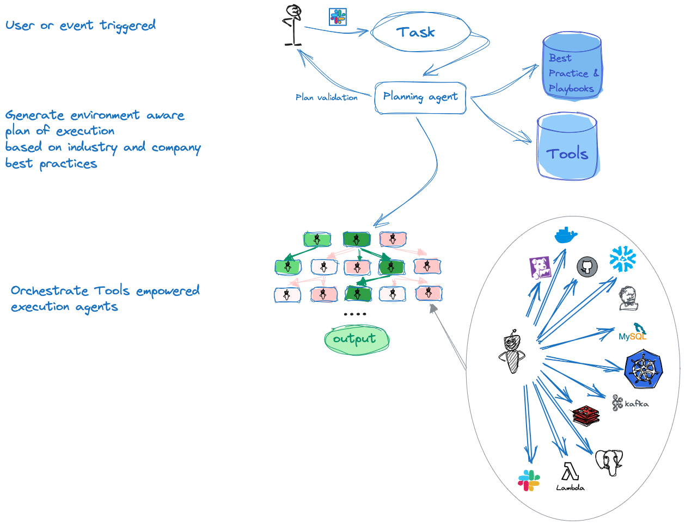

[](https://opensource.org/licenses/Apache-2.0)

<p align=center>
   <a href="https://genia.dev" target="_blank">
      
   </a>
</p>
<br>
<p>
Meet your new AI platform engineering team member, it is able to work alongside you in your production environment, executing tasks on your behalf.
It is up-to-date with the latest industry best practices, yet knows how you run things on your team. it is capable of learning and executing tasks for you, making more impact. faster.
<br>
GeniA is intuitive yet powerful, a quick learner and right in your team's Slack channel.
</p>

## 📝 Table of Contents

1. [🎉 Introduction](#introduction)
2. [▶️ Getting started](#getting-started)
3. [🤝 Contributing](#contributing)
4. [📜 License](#license)
5. [📞 Contact](#contact)
6. [🚀 Future Plans](#future-plans)

#### Full documentation can be found [here](https://genia-dev.github.io/GeniA/)

## Introduction

While ChatGPT and CoPilot have garnered significant attention for their ability to assist with writing new code, as software engineers, we understand that coding is merely one aspect of our daily responsibilities and AI presents many additional opportunities to minimize boilerplate, time wasters and cross team dependencies.

**Under the hood** GeniA is built upon the [function-calling capabilities offered by OpenAI](https://openai.com/blog/function-calling-and-other-api-updates) (OpenAI or Azure). GeniA requires OpenAI API Key, you can generate one [here](https://platform.openai.com/account/api-keys)

### GeniA is 100% open source!

Built with love by engineers for engineers, our goal is to help teams harness the power of LLMs to boost how fast you can go!

### GeniA can be expanded

GeniA is designed to be a fast learner, quickly acquiring the ability to utilize your customized tools. We've streamlined the learning process to make it as straightforward as possible. You can find instructions on how to teach GeniA to use additional tools [here](https://genia-dev.github.io/GeniA/add-new-tool/).

### GeniA is Production grade

We have set ourselves the goal of building a production-grade software right off the bat. Now, you can start working with GeniA in production by installing the GeniA container, integrate it into your team's Slack channel, and let it land on its feet running.

### Project philosopy

"... And, a human on a bicycle, blew the condor away, completely off the top of the charts. that’s what a computer is to me. What a computer is to me is it’s the most remarkable tool that we’ve ever come up with"

-*someone*

### Workflow

<p float="center">
   
</p>
<br/>

## Imagine a new AI team member helping you with:

#### Research & Development Scenarios

Deployment, troubleshooting, log summarization, build initiation, PR digesting

* Deploy your k8s-based service to staging/production using Argo
* Investigate the cause of the last Argo deployment failure
* [Additional examples](./media/README.md#rd-scenarios)

#### FinOps Shift-Left

Reporting on unused resources, optimizing cloud expenditure.

* Generate a report detailing unutilized cloud resources per team and share it on Slack
* Create a usage report for AWS ECR (Amazon Elastic Container Registry) to identify potential cost-saving opportunities
* [Additional examples](./media/README.md#rd-scenarios#finops-shift-left)

#### SecOps Shift-Left

Vulnerability checks, best practices, playbooks.

* Conduct a security vulnerability analysis on your S3 buckets
* Grant me temporary permissions to production
* [Additional examples](./media/README.md#secops-shift-left)

#### SRE Shift-Left

lower your MTTR, Service usage monitoring, service optimization.

* Have a virtual SRE expert team member on your side during production outage troubleshooting
* Increase the memory for my Node service deployed on a k8s cluster
* [Additional examples](./media/README.md#sre-shift-left)

#### DevOps Shift-Left

Scaling services, managing EC2 instances and cron jobs, coding utilities.

* upgrade EKS or ELK cluster version on staging and then on production
* [Additional examples](./media/README.md#devops-shift-left)
  <br/>

### Demo: GeniA troubleshoots a production incident

https://github.com/genia-dev/GeniA/assets/16246393/8928cafa-b96b-4469-b393-b37635621624

### Many more great examples [can be found here](./media/)

## Getting Started

```
pip3 install streamlit genia
```

Then you can run the streamlit web app by:

```
genia
```

For more details please see our [documentation here](https://genia-dev.github.io/GeniA/getting-started/)
Once installed and granted with permissions, a few great example scenarios [can be found here](./media/)

## Contributing

We would appreciate your contributions! 🙌🌟💖
👩‍💻➕👨‍💻 Fork GeniA repository, make your changes, and submit a pull request!
More details can be found [here](./CONTRIBUTING.md).

## License

Licensed under the Apache License, Version 2.0 (the "License"); you may not use this file except in compliance with the License. You may obtain a copy of the License at

http://www.apache.org/licenses/LICENSE-2.0

Unless required by applicable law or agreed to in writing, software distributed under the License is distributed on an "AS IS" BASIS, WITHOUT WARRANTIES OR CONDITIONS OF ANY KIND, either express or implied. See the License for the specific language governing permissions and limitations under the License.

[LICENSE](./LICENSE)

## Contact

Got an idea to improve our project? We'd love to hear it and collaborate with you. Don't hesitate to reach out to us! Just open an [issue](https://github.com/GeniA-dev/GeniA/issues) and GeniA will respond to you 🦸‍♀️🦸‍♂️ !
You can see details [here](./.github/ISSUE_TEMPLATE/submit-a-request.md).

## Future Plans

- OKTA integration for SSO.
- RBAC Support.
- Extending capabilities with thousands of new tools.

#### Full documentation can be found [here](https://genia-dev.github.io/GeniA/)
