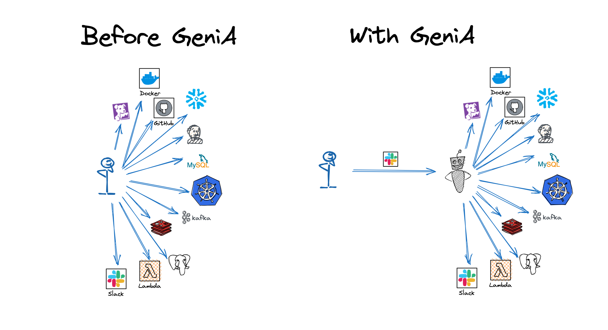
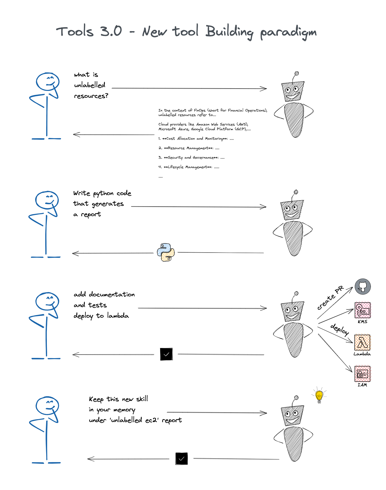

[](https://opensource.org/licenses/Apache-2.0)

<p align=center>
   <a href="https://genia.dev" target="_blank">
      
   </a>
</p>
<br>
<p>
Imagine a ChatGPT integrated with your team's tools and APIs, capable of executing tasks and handling queries independently, contributing to time and energy efficiency.
<br><br>
GeniA is an AI assistant developed for engineering tasks. GeniA is a dynamic, intuitive tool capable of managing tasks in your team's Slack channel.
</p>

## 📝 Table of Contents

1. [🎉 Introduction](#introduction)
   1. [🌟 Features](#features)
   2. [🆚 Comparison to LLM](#comparison-to-llm)
   3. [🔌 Supported Tools](#supported-tools)
   4. [⚙️ Expanding GeniA's Toolbox](#expanding-genias-toolbox)
   5. [🚀 Future Plans](#future-plans)
   6. [🔒 Security
2. [▶️ Getting started](#getting-started)
   1. [🔧 Installation](#installation)
   2. [ 📖 Developer Guide](#developer-guide)
3. [🤝 Contributing](#contributing)
4. [📜 License](#license)
5. [📞 Contact](#contact)

## Introduction

While ChatGPT and CoPilot have garnered significant attention for their ability to assist with writing new code, as software engineers, we understand that coding is merely one aspect of our daily responsibilities and AI present many additional opportunities to minimize bolier plate, time wasters and cross team dependencies.

**Under the hood** GeniA built upon the [function-calling capabilities offered by OpenAI](https://openai.com/blog/function-calling-and-other-api-updates). Azure OpenAI supported as well.

GeniA requires OpenAI API Key, you can generate [here](https://platform.openai.com/account/api-keys)

### GeniA is 100% open source!

Built with love by engineers for engineers, our goal is to help teams harness the power of LLMs to boost how fast you can go!

### GeniA is Production grade

we have set ourselves the goal of building a production-grade software right off the bat. Now, you can start working with GeniA in production by installing the GeniA container, integrate it into your team's Slack channel, and let it land on its feet running.

### Imagine a virtual asisstant empowering you with:

#### Research & Development Scenarios

Deployment, troubleshooting, log summarization, build initiation, PR digesting

* `Deploy your k8s-based service to staging/production using Argo`
* `Investigate the cause of the last Argo deployment failure`
* `Summarize the recent logs from your Node.js service`
* `Initiate a new Jenkins build`
* `Summarize GitHub pull request along with its content`

#### FinOps Shift-Left

Reporting on unused resources, optimising cloud expenditure.

* `Generate a report detailing unutilized cloud resources per team and share it on Slack`
* `Create a usage report for AWS ECR (Amazon Elastic Container Registry) to identify potential cost-saving opportunities`

#### SecOps Shift-Left

Vulnerability checks, best practices, playbooks.

* `Conduct a security vulnerability analysis on your S3 buckets`
* `Grant me temporary production permissions (Add me temporarily to an IAM user group with auditing)`

#### SRE Shift-Left

lower your MTTR, Service usage monitoring, service optimization.

* `Examine my service usage metrics for any anomalies`
* `Increase the memory for my Node service deployed on a k8s cluster`

#### DevOps Shift-Left

Scaling services, managing EC2 instances and cron jobs, coding utilities.

* `Scale out my Node.js k8s-based service`
* `Identify unlabeled EC2 instances`
* `Set up a cron job to trigger a task`
* `Develop code for a new utility and deploy my 'automate this task' snippet to a lambda function`
* `Trigger any of my company's predefined playbooks`

<p align="center">
<br/>
<br/>
   
<br/>
</p>

### Many more great examples [can be found here](./media/)

<br/>

### Introducing Tools 3.0: Enhance Coding with Large Language Models

Tools 2.0 with low-code/no-code approaches have been revolutionary, allowing users to leverage drag-and-drop functions over traditional coding for certain use cases.

However, with the advent of Language Learning Models (LLMs), Tools 3.0 pushes the boundary further, empowering everyone to write code using natural language. It signifies a shift from proprietary, restrictive design paradigms to a more open, innovative approach where the model assists in understanding and revising complex code snippets.

Tools 3.0 negates the need for proprietary YAML files and vendor-specific domain languages (DSLs), urging users to rely on native code. Rather than waiting for vendor updates to fulfill requirements, users can now instruct LLMs to write code, create it themselves, or utilize the vast range of community-contributed tools.

Remember, any class, method, or API available becomes a learning and application tool for GeniA. Tools 3.0 redefines coding, transforming it into an intuitive, flexible, and democratized process.

## Features

GeniA's unique features include:

1. **Production-Grade**: Engineered for real-world applications.
2. **Collaborative assistant**: Designed to make the development process more interactive and enjoyable.
3. **Proactively taking action**: building, coding, executing, summarizing. not just giving you a good advice.
4. **Customizable and Extensible**: As an open-source tool, GeniA can be tailored to your specific needs.
5. **Quick Learner**: Rapidly adapts to new tools and APIs.

## Comparison to LLM

**Safety Prioritized:** While LLMs offer suggestions, GeniA goes a step further but with utmost caution. It's designed to function responsibly in live environments, ensuring it doesn't take unrestricted decisions.

**Beyond Recommendations:** Where LLMs provide guidance, GeniA offers proactive assistance. It doesn't just advise on the steps you need to take but goes ahead to perform the tasks itself. You could provide a code snippet, and GeniA will handle its deployment to Lambda, integrating seamlessly with your production environment and CI/CD tools.

**Intelligent Tool Selection:** GeniA is not just another tool, it's also a tool-finding system. It's designed to acquaint itself with an expansive set of tools. However, mindful of the limitations of the LLM context window and token costs, it optimizes and feeds the model with only the most relevant tools. Utilizing vector databases (FAISS by default), GeniA selects tools with descriptions that align best with your intent. This smart selection process allows GeniA to work more efficiently and be more responsive to your specific needs.

## Supported Tools

<p align="center">
<br/>
<br/>
   
<br/>
</p>

1. [ArgoCD](https://argoproj.github.io/cd/)
2. [AWS](https://aws.amazon.com/)
3. [GitHub](http://github.com/)
4. [Jenkins](https://www.jenkins.io/)
5. [Kubernetes](https://kubernetes.io/)
6. [Open Policy Agent (OPA)](https://www.openpolicyagent.org/)
7. [PagerDuty](https://www.pagerduty.com/)
8. [Slack Webhook](https://api.slack.com/messaging/webhooks)
9. Dozens of more tools are coming really soon

The details of supported tools can be found [here](./genia/tools_config/core/tools.yaml).
The list of OpenAI functions spec which used by the tools can be found [here](./genia/tools_config/core/functions.json).

## Growing GeniA's Toolbox

<p align=center>
   <a href="https://genia.dev" target="_blank">
      
   </a>
</p>
<br>

### Teaching GeniA new Skills: Adding Tools Effortlessly

Adding a new tool adheres to the [OpenAI JSON configuration](https://platform.openai.com/docs/api-reference/chat/create#chat/create-functions) standards. This ensures compatibility, making it easy to import any existing function-calling project or ChatGPT plugin.
The only missing component is a brief description guiding the model on when to use the function. We prefer to maintain this in a separate file - refer to the [tools.yaml](./genia/tools_config/core/tools.yaml).

GeniA is designed to be a quick learner, rapidly acquiring the capability to use new tools. We've made the learning process as straightforward as possible. Here's how you can teach GeniA:

1. **Incorporating Code Tools:** By adding a simple specification, GeniA can invoke any class and method within your codebase. For instance, below is an example of integrating a utility tool from your software development suite:

```yaml
- tool_name: bug_tracker_api
  category: python
  class: mypackage.utilities.bugtracker.BugTrackerAPIWrapper
  method: run

```

2. **Connecting to URLs:** GeniA can perform GET requests with either path or request parameters. You can integrate this by providing a URL, as shown in this example, which fetches the current CI/CD pipeline status:

```yaml
- tool_name: get_pipeline_status
  title: fetch the current pipeline status
  category: url
  template: https://ci.yourserver.com/api/v1/pipeline?project_id={project_id}&pipeline_id={pipeline_id}
```

3. **Utilizing OpenAPI Swagger Files:** Imagine your AI model being able to invoke any API out there - GeniA is capable of that! You can easily integrate any standard OpenAPI into GeniA using a Swagger file. This feature is still under development, but a working example is provided out of the box.
4. **Learning Natural Language Skills:** This is where LLM truly shines. GeniA has an experimental feature that allows it to acquire new skills using natural language. It retains the steps taken to accomplish a task in its long-term memory, categorizes them under a new skill, and loads them into memory for future use. In this way, GeniA can learn and execute complex tasks, all in natural language.

##### see complete function [documentation here](./genia/tools_config/extended/)

## Future Plans

- Azure-based Open AI support.
- OKTA integration for SSO.
- RBAC Support.
- Extending capabilities with thousands of new tools.

### Can GeniA Interface with Any Existing API?

Indeed, GeniA has the capability to connect with any available API. Although it's currently an active area of academic research rather than a full-fledged production-grade tool, we've adapted OpenAI's plugin approach for increased simplicity and wider integration possibilities. You can incorporate GeniA into any existing code classes or APIs.

Our ultimate achievement is empowering GeniA to acquire new skills without necessitating model fine-tuning or, in many cases, redeployment of your service. However, it's worth noting that the introduction of a completely new tool might call for some prompt adjustments and testing.

Presently, the authentication process for a new tool falls on the tool creator. However, we plan to standardize this aspect within the project framework shortly.

## Security

GeniA is stateless. It connects with cloud DBs for conversation storage and handles secrets via environment variables. Plans are in place for standard secrets store provider integration.

On the subject of secrets management, the project currently utilizes environment variables, as defined in the [.env.template](.env.template) file. However, we are actively developing integrations with standard secrets store providers for improved security.

**We presently advise the integration of GeniA within a designated private channel, accessible exclusively to a whitelist of approved engineers.**

We are actively developing Single Sign-On (SSO) and Role-Based Access Control (RBAC) features for GeniA. These enhancements are slated for release in the near future.

## Getting started

The easiest way to get started with GeniA is [Streamlit](https://streamlit.io/) web app. Make sure you have `python3` & `pip3` installed, then run:

```
pip3 install streamlit genia
```

Then you can run the streamlit web app by:

```
genia
```

You can also play with GeniA in terminal using the local mode. Once you done to play with it you can move to the collaborative mode as a Slack App Bot. For simplicity, we recommend running it locally using [Docker](#run-via-docker). If a local installation is desired, please refer to the [Installation](#installation) section.

When using Azure OpenAI, you need to also configure those environment variables:

```
OPENAI_API_DEPLOYMENT=
OPENAI_API_TYPE="azure"
OPENAI_API_BASE=https://<your-endpoint.openai.azure.com/
OPENAI_API_VERSION="2023-07-01-preview"
```

> **Note:**
> GeniA uses OpenAI, be mindful of cost implications and ensure you set usage limits. You can configure both soft and hard limits at the following URL: https://platform.openai.com/account/billing/limits.

By default, GeniA is set to use `gpt-3.5-turbo-0613`. We acknowledge that `gpt-4-0613` often delivers superior results, but have found the 3.5 version to be a more cost-effective choice.

## Installation

### Run in Slack App Bot

#### Create Slack App Bot

> **Note:**
>
> When it comes to [Choosing a protocol to connect to Slack](https://api.slack.com/apis/connections), there are two primary options. In this instance, we utilize `Socket Mode`, enabling your app to leverage the `Events API` and the platform's interactive components without the need for a public HTTP Request URL. Instead of sending payloads to a public endpoint, Slack employs a WebSocket URL to communicate with your app.

For the Slack GPT Bot to function effectively, it's crucial to establish the correct permissions for your Slack bot. Please follow the forthcoming guidelines to set up the necessary permissions:

1. In the project's root directory, mv the [.env.template](./.env.template) into `.env` file and input your Slack keys
2. Create a new [Slack App](https://api.slack.com/authentication/basics).
3. Navigate to your [Slack API Dashboard](https://api.slack.com/apps) and select the app you've created for this bot.
4. On the left-hand side menu, click on `OAuth & Permissions`.
5. Within the `Scopes` division, there are two categories of scopes: `Bot Token Scopes` and `User Token Scopes`. Append the following scopes under `Bot Token Scopes`:
   `app_mentions:read`
   `chat:write`
   `channels:history`
   `groups:history`
   `im:history`
   `mpim:history`
6. Ascend to the `OAuth Tokens for Your Workspace` and hit the `Install App To Workspace` button. This operation will produce the `SLACK_BOT_TOKEN`.
7. On the left-hand side menu, click on `Socket Mode` and activate it. You'll be asked to `Generate an app-level token to enable Socket Mode`. Generate a token labeled `SLACK_APP_TOKEN` and include the `connections:write` scope.
8. In the `Socket Mode` page's `Features affected` section, hit `Event Subscriptions` and switch `Enable Events` to the `On` state. Append the app_mention event, coupled with the `app_mentions:read` scope in the `Subscribe to bot events` subsection below the toggle.

### Run via Docker

Handle secrets by copy the [.env.template](./.env.template) into `.env`, and put in `.env` the minimal secrets which is just `OPENAI_API_KEY`

### Run in local terminal mode

```
docker run -p 5001:5001 --env-file ./.env -it geniadev/genia:latest
```

### Run in slack app bot mode

```
docker run -p 5001:5001 --env-file ./.env -it geniadev/genia:latest slack
```

## Developer Guide

### Run GeniA from source :: Docker

```
git clone https://github.com/GeniA-dev/GeniA
cd GeniA
docker build -t geniadev/genia:latest .
```

Run via [Docker](#run-via-docker)

### Run GeniA from source :: Python

#### Poetry install

```
curl -sSL https://install.python-poetry.org | python3 -
```

#### Run in local terminal mode

```
poetry run local
```

#### Run in slack app bot mode

[First install the bot](#create-slack-app-bot)

```
poetry run slack
```

### Run in streamlit mode

```
poetry run streamlit
```

### Testing

```
poetry run pytest tests
```

# Contributing

👩‍💻➕👨‍💻 Fork GeniA repository, make your changes, and submit a pull request! We appreciate your contributions! 🙌🌟💖
More details can be found [here](./CONTRIBUTING.md).

# License

Licensed under the Apache License, Version 2.0 (the "License"); you may not use this file except in compliance with the License. You may obtain a copy of the License at

http://www.apache.org/licenses/LICENSE-2.0

Unless required by applicable law or agreed to in writing, software distributed under the License is distributed on an "AS IS" BASIS, WITHOUT WARRANTIES OR CONDITIONS OF ANY KIND, either express or implied. See the License for the specific language governing permissions and limitations under the License.

[LICENSE](./LICENSE)

# Contact

Got an idea to improve our project? We'd love to hear it and collaborate with you. Don't hesitate to reach out to us! Just open an [issue](https://github.com/GeniA-dev/GeniA/issues) and GeniA will respond to you 🦸‍♀️🦸‍♂️ !
You can see details [here](./.github/ISSUE_TEMPLATE/submit-a-request.md).
