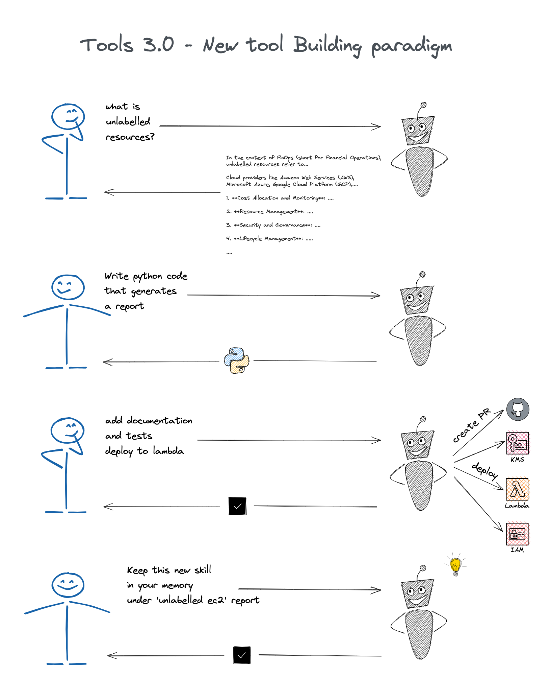

# We introduce Tools 3.0

### Enhanced Coding with Large Language Models

Up until now, using Tools 2.0 with low-code/no-code approaches have been revolutionary, allowing users to leverage drag-and-drop functions over traditional coding for certain use cases.

However, with the advent of Language Learning Models (LLMs), Tools 3.0 pushes the boundary further, empowering everyone to write code using natural language. It signifies a shift from proprietary, restrictive design paradigms to a more open, innovative approach where the model assists in understanding and revising complex code snippets.

Tools 3.0 negates the need for proprietary YAML files and vendor-specific domain languages (DSLs), urging users to rely on native code. Rather than waiting for vendor updates to fulfill requirements, users can now instruct LLMs to write code, create it themselves, or utilize the vast range of community-contributed tools.

Remember, any class, method, or API available becomes a learning and application tool for GeniA. Tools 3.0 redefines coding, transforming it into an intuitive, flexible, and democratized process.

   

